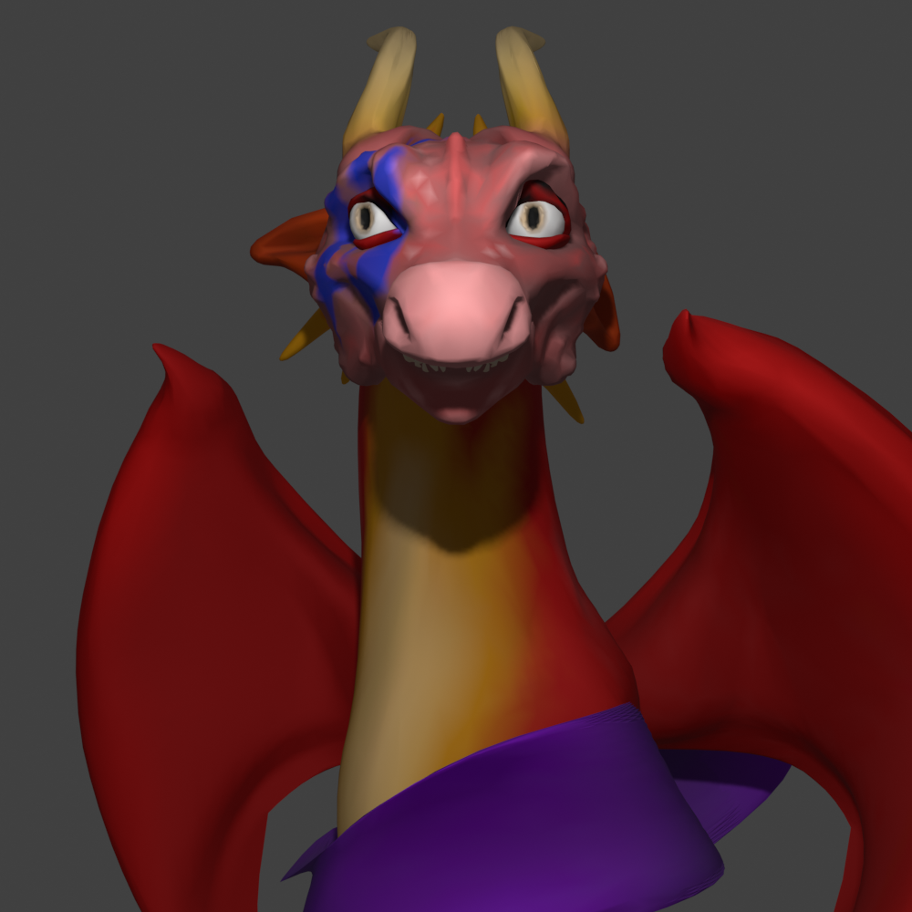
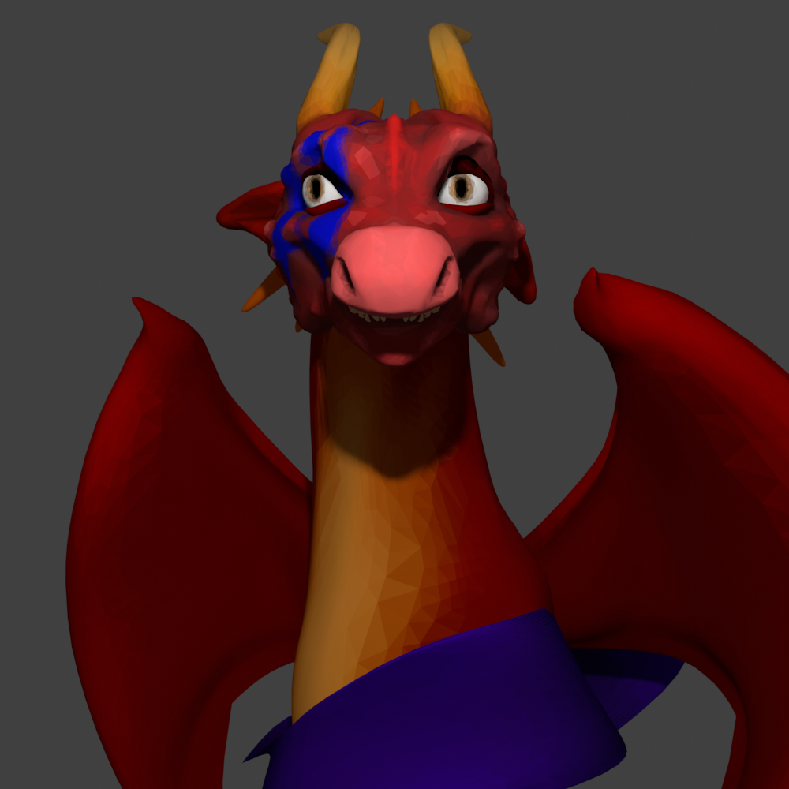
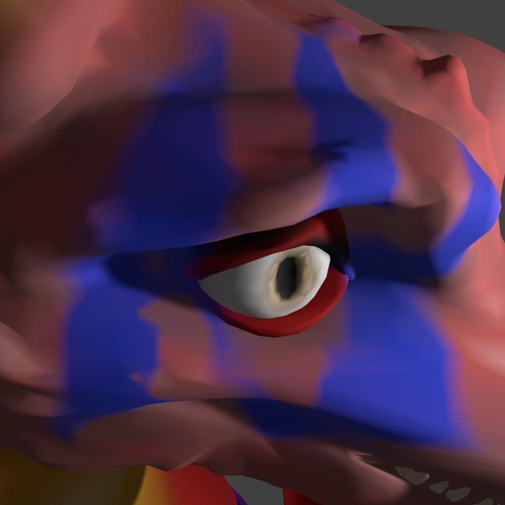
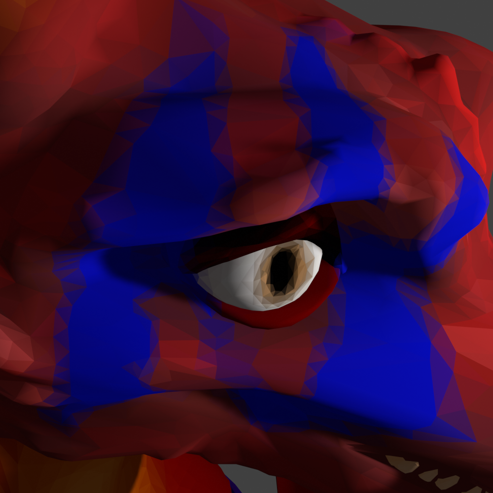

# vcolor2palette

Converts mesh with vertex color into mesh with palette texture.

## Requirements

- Python 3.7+
- Open3D, NumPy, PIL, click: \
    `pip install -r requirements.txt`

### Usage

```bash
python src/main.py input_mesh.gltf output_mesh.obj output_palette.png
```

### Example

* Used model: [Dragon Head](https://sketchfab.com/3d-models/dragon-head-298b72400c3643c2b9c570d0e6442e5d)
* Generated Palette: [Palette](example/palette.png)

Left side: original mesh with vertex color, Right side: mesh textured with palette








